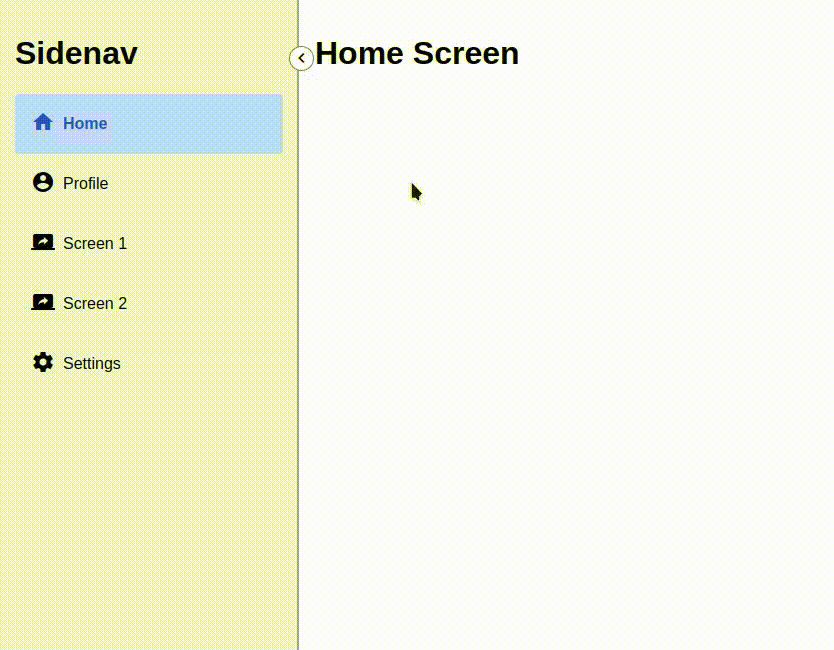

# Dynamic, Toggleable, Resizeable Sidenav

This is a sidenav implementation made with Angular. It can be toggled, resized, and dynamically populated with content.

## Demo

## Article Links

Here are links to articles that explain how this sidenav was built:

1. [Base Sidenav](https://medium.com/@aziznal/the-ultimate-sidenav-guide-with-angular-resizeable-dynamic-and-toggleable-c42dc057798d)

2. [Toggleable Sidenav](https://medium.com/@aziznal/crafting-a-toggleable-sidenav-in-angular-f9fcec25aa77)

3. [Resizeable Sidenav](https://medium.com/@aziznal/crafting-a-resizable-sidenav-in-angular-4cdb77bd441a)

4. [Dynamic Sidenav](https://medium.com/@aziznal/crafting-a-dynamic-sidenav-in-angular-7bb7db2e53c6)
